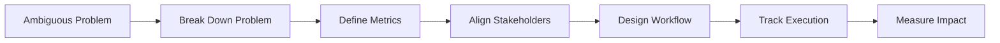

<h1 align="center">Bhavya Dubey </h1>

  <b>Program Manager | Systems Thinker | Execution Operator</b>

  

  
  
  
  

## What I Do

I build systems that make execution **predictable, scalable, and efficient**.

Most teams don’t struggle with ideas—they struggle with execution.  
I focus on turning unclear, messy problems into structured workflows, aligning stakeholders, and ensuring programs actually deliver outcomes.

## My Operating System

Ambiguity → Clarity → Alignment → Systems → Execution → Impact

- Break complex problems into executable components  
- Align cross-functional teams without friction  
- Replace manual coordination with structured systems  
- Use data to continuously improve performance  

## What I’ve Built

### 🔹 Execution Systems at Scale
- Designed workflows to standardize execution across teams  
- Reduced manual dependencies and coordination overhead  
- Built operating cadences for consistency  

### 🔹 Data-Driven Program Systems
- Defined SLAs, KPIs, and quality benchmarks  
- Built dashboards for real-time visibility  
- Enabled data-backed decision making  

### 🔹 High-Ambiguity Program Delivery
- Translated unclear goals into structured execution plans  
- Balanced competing stakeholder priorities  
- Delivered under tight timelines and uncertainty  

## Featured Technical Projects

### 🌫️ RefineDNet – Image Dehazing System  
*From research → real-world product*

- Hybrid model (DCP + CNNs) for image dehazing  
- Perceptual fusion strategy for better output quality  
- Built Streamlit app with adjustable intensity (0.1–0.9)  

**Impact**
- Improved usability of dehazing systems  
- Enabled real-time image processing  
- Bridged ML research with practical application  

### Sentiment Analysis for Financial Markets  
*Turning noise into signals*

- Processed financial data from Twitter & news sources  
- Built NLP pipeline for sentiment classification  
- Linked sentiment insights with stock trends  

**Impact**
- Enabled data-driven insights from unstructured data  
- Reduced manual analysis effort  
- Demonstrated real-world NLP application  

### Heart Disease Prediction System  
*End-to-end ML system (data → model → UI)*

- MLP model using 14 medical parameters  
- Processed multiple healthcare datasets  
- Built UI using HTML/CSS  

**Impact**
- Created accessible predictive healthcare solution  
- Demonstrated full system thinking  
- Applied ML in high-impact domain  

## What Makes Me Different

Most people manage execution.  
I design systems that make execution scalable.

Clarity > Complexity  
Systems > Effort  
Execution > Ideas  

## How I Think About Execution

## Current Focus

Currently focused on building systems that make execution more predictable and scalable:

-  Scaling execution across complex, cross-functional environments  
-  Driving operational efficiency through structured workflows  
-  Designing data-driven systems for decision-making  
-  Bringing clarity to ambiguity in fast-moving environments  

📫 Let’s Connect

   

 ⭐ If you're building high-impact systems or scaling execution, let's talk. 
 
