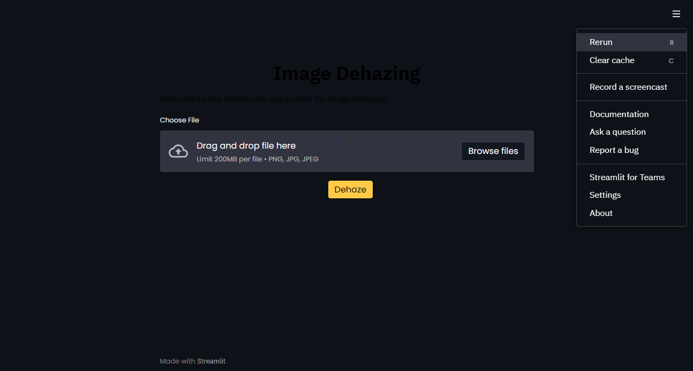
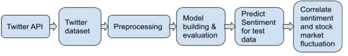
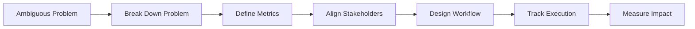

<h1 align="center"> Bhavya Dubey </h1>

  <b>I design systems that make execution actually work.</b>

  Program Manager • Systems Thinker • Execution Operator

  

  
  
  
  

   Systems over chaos &nbsp;&nbsp;•&nbsp;&nbsp;
   Data over guesswork &nbsp;&nbsp;•&nbsp;&nbsp;
   Execution over ideas

## What You’ll Find Here

- Systems & execution frameworks  
- Real-world program management case studies  
- Data-driven workflows & tools  
- Practical ways to scale operations  

Follow if you care about execution that actually works.

## What I Do

I build systems that make execution **predictable, scalable, and efficient**.

Most teams don’t struggle with ideas, they struggle with execution. I focus on turning unclear, messy problems into structured workflows, aligning stakeholders, and ensuring programs actually deliver outcomes.

## My Operating System

  <b>Ambiguity → Clarity → Alignment → Systems → Execution → Impact</b>

##  What I’ve Built

<table>
<tr>

<td width="30%" valign="top">

<h3> Execution Systems</h3>

• Standardized workflows 
• Reduced manual dependencies 
• Built operating cadences

</td>

<td width="30%" valign="top">

<h3> Data Systems</h3>

• Defined SLAs & KPIs 
• Built dashboards 
• Enabled data-driven decisions

</td>

<td width="30%" valign="top">

<h3> High-Ambiguity Delivery</h3>

• Structured unclear problems 
• Balanced stakeholders 
• Delivered under pressure

</td>

</tr>
</table>

## Featured Technical Projects

1. RefineDNet
2. Sentiment Analysis
3. Heart Disease

---

## RefineDNet – Image Dehazing System  

<i>From poor visibility → clear vision → usable systems</i>

 

  

  

<i>Interactive Streamlit Interface</i>

 

### The Problem

In real-world environments autonomous driving, surveillance, vision systems **haze destroys visibility.** Traditional methods try to fix this using assumptions. Deep learning methods need **paired data** (which is rare).

So the real question was:

> Can we remove haze **without perfect training data**?

### What I Built

A **two-stage dehazing system** combining:
- Prior-based method (**DCP**) for initial restoration  
- Learning-based model (**CNNs**) for refinement
  
Then i added a **perceptual fusion strategy** to improve realism.

### What Happens Next?

- Input image → heavily distorted by haze  
- Stage 1 → restores basic visibility  
- Stage 2 → refines structure & realism  
- Fusion → enhances perceptual quality  

Hence the image becomes **clear enough for real-world use**

### Product Layer (Not Just a Model)

Instead of stopping at the model, I built:

- A **Streamlit web app**  
- Upload `.png/.jpeg` images  
- Adjust dehazing intensity (0.1 → 0.9)  
- Get real-time processed output  

### The Outcome

- Removed dependency on paired training datasets  
- Improved real-world usability of dehazing systems  
- Transformed research → interactive product 

---

## Sentiment Analysis for Financial Markets  

<i> From noisy opinions → structured signals → market insight</i>

 

  

<i>How unstructured sentiment becomes actionable insight</i>

 

### The Problem

Financial markets react not just to numbers but also to **perception**. News articles, tweets, and opinions constantly influence price movements.  
But this data is:
- Unstructured  
- Noisy  
- Impossible to analyze manually at scale  

So the real question is:

> Can sentiment be transformed into a **reliable signal for market trends**?

### What I Built

A **data pipeline that converts text → sentiment → signals**, which works as follows:

- Collected financial data from Twitter & news sources (NIFTY 50 ecosystem)  
- Built an NLP pipeline to classify sentiment (positive / negative / neutral)  
- Linked sentiment patterns with stock price behavior  

### What Happens Next?

- Raw tweets & news → cleaned and structured  
- Sentiment extracted across multiple sources  
- Signals aggregated over time  
- Compared against market movements
 
Then patterns start emerging between **public sentiment and price trends**

### The Insight:

What looks like random noise, starts behaving like **early indicators**.

Not perfect predictions but directional signals that:
- Highlight momentum  
- Surface market sentiment shifts  
- Support data-backed decisions  

### The Outcome:

- Reduced manual effort in analyzing financial sentiment  
- Converted unstructured text into usable signals  
- Demonstrated real-world application of NLP in decision systems 

---

## Heart Disease Prediction System  

<i>From patient data → predictive insight → early intervention</i>

### The Problem

Cardiovascular diseases remain one of the leading causes of death globally.
Early detection can save lives—but:
- Diagnosis often requires time and expert evaluation  
- Data exists, but is underutilized  
- Many systems are expensive or complex  

So the real question was:

> Can we use patient data to **predict risk early and accessibly**?

### What I Built

An **end-to-end machine learning system**:

- Used a Multilayer Perceptron (MLP) model  
- Trained on multiple healthcare datasets:
  - Cleveland  
  - Hungarian  
  - Long Beach  
- Processed 14 key medical parameters:
  - Age, BP, Cholesterol, etc.  

Then built a **simple UI using HTML/CSS** to make it usable.

### What Happens Next?

- Patient inputs medical parameters  
- Model processes historical patterns  
- Risk prediction is generated instantly  

After which data turns into **early warning signals**

### The Insight

Prediction alone isn’t valuable **accessibility is**.

A model sitting in a notebook doesn’t help. A simple interface that anyone can use does.

### The Outcome

- Created a low-cost, accessible prediction system  
- Demonstrated full pipeline: data → model → interface  
- Showed how ML can be applied in high-impact domains

## What Makes Me Different

Most people manage execution.  
I design systems that make execution scalable.

Clarity > Complexity  
Systems > Effort  
Execution > Ideas  

## How I Think About Execution

## Current Focus

Currently focused on building systems that make execution more predictable and scalable:

-  Scaling execution across complex, cross-functional environments  
-  Driving operational efficiency through structured workflows  
-  Designing data-driven systems for decision-making  
-  Bringing clarity to ambiguity in fast-moving environments  

## Let’s Connect

If you're working on:
- Scaling execution across teams  
- Fixing unclear or messy workflows  
- Building systems that improve efficiency  

I’d love to collaborate or contribute.

  
  

  ⭐ Always open to interesting problems, sharp teams, and high-impact work⭐

